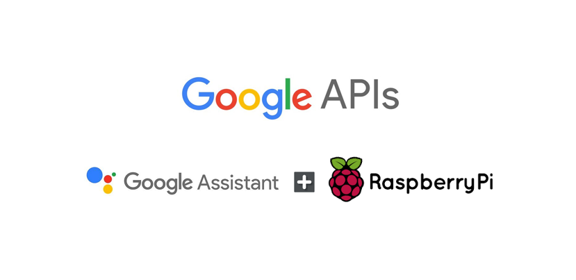
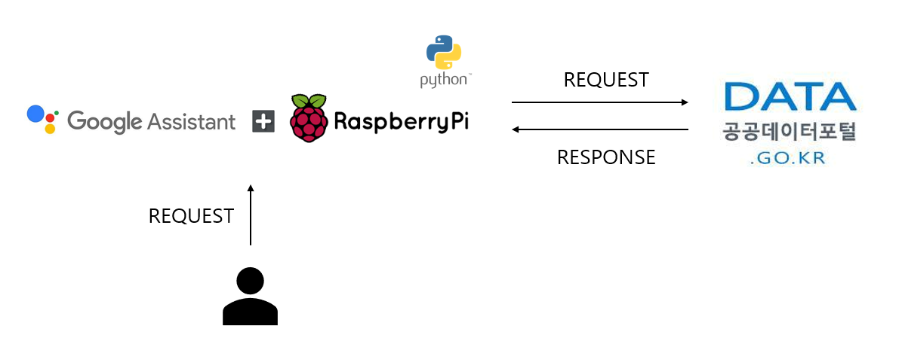
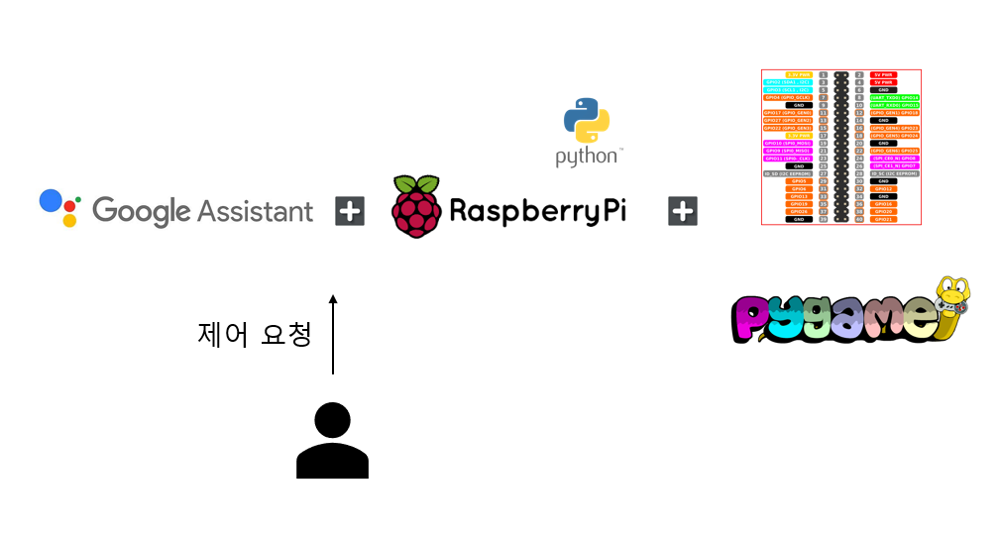
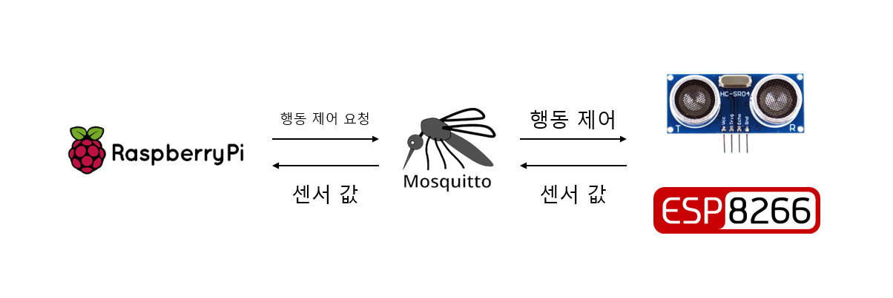

# project_SCE

## 2022 project - Smart Car Environment with C & Python [미니 프로젝트]

* [Markdown 문법 사용하기](http://whatismarkdown.com/)

* 시스템 구성도 확인하기

# 1. 프로젝트 개요
> ## Make 'connected' & 'smart' car environment for next project
Raspberry pi4 + Arduino uno & nodeMCU를 활용해 사용자가 차량을 운용하는 방식에 도움을 주고, 편의성을 증대하고 원하는 데이터를 활용할 수 있는 환경을 구축한다. 시리얼 통신, 와이파이 통신 등을 사용해 펌웨어와 소프트웨어 간의 데이터 교환을 통해 적절한 제어 환경을 만들어 보는 것이 목적이다.

# 2. 개발 환경
* [Raspberry pi4](https://www.raspberrypi.com/products/raspberry-pi-4-model-b/) 
* OS - Raspberry pi OS(32-bit, a port of Debian) version Bullseye
* [Arduino Uno](https://docs.arduino.cc/hardware/uno-rev3)
* [ESP8266](https://arduino-esp8266.readthedocs.io/en/latest/) nodeMCU

# 3. 프로젝트 아이디어
## 3.1 Raspbeery pi4 + Google Assistant Customize
> *"OK Google, 지금 날씨 알려줘"*

라즈베리 파이에 구글 어시스턴트 API를 연동시켜 사용자의 명령에 따라 적절한 제어를 수행하는 소프트웨어 환경을 구축한다. 제어는 사용자의 음성을 통해 이루어지며, 와이파이를 사용한 통신 환경에서 이루어진다. 또한 구글 API에서 기본으로 제공하는 로직 외에, 사용자가 원하는 기능을 커스텀해서 사용한다.

<그림 1 - RPi + Google Assistant>

### 3.1.1 원격 단말 기기 제어 시스템
> 간단한 음성 명령으로 원거리의 단말을 제어할 수 있다. *ex) 백라이트 켜 줘*

사용자는 간단한 음성 명령을 통해 같은 Wifi 통신망 내에 있는 단말들에게 제어 명령을 내릴 수 있다. 이번 프로젝트에서는 ESP8266 단말에 설치된 LED를 제어하는 간단한 통신 환경을 구축했다. 단말의 활용도는 무궁무진하기 때문에 활용성이 굉장히 높을 것으로 보인다.

<그림 2 - 원격 Wifi 통신 사용 단말 제어>

### 3.1.2 Open API를 활용한 정보 제공 시스템
> *"영동선 속사 IC 교통상황 알려줘"*

마찬가지로 구글 어시스턴트 API를 커스터마이즈 해서 사용자의 요청을 처리해준다. 이번 프로젝트에서는 한국도로공사에서 제공하는 실시간 소통 데이터 API를 활용해 정보를 제공한다.

<그림 3 - Open API를 활용한 정보 제공 시스템>

### 3.1.3 RPi 내장 하드웨어 제어하기 with GPIO & pygame
> *"노래 틀어 줘"*, *"불 켜"*

원격 단말 노드를 제어하는 것이 아닌, RPi 자체를 제어할 수 있다. 이번 프로젝트에서는 RPi에 내장된 하드웨어 제어 기능을 추가했다. GPIO 핀을 활용해 간단한 LED를 제어하고, pygame 라이브러리를 활용해 내장되어있는 음악을 틀을 수 있게 설계했다.

<그림 4 - RPi 제어 시스템>

## 3.2 Real-time Service Delivery System
### 3.2.1 실시간 원격 단말 통신 시스템
> 단말에서 들어오는 실시간 데이터를 활용해 제어할 수 있다.

원격 단말 ESP8266에서 들어오는 실시간 초음파 센서 값 데이터를 활용해 간단한 안전 장치 시스템을 만들었다. 실시간으로 들어오는 값이 비약적으로 증가하는 순간을 포착해, 추락 위험이 있음을 감지하고 적절한 제어 명령을 전달한다.

<그림 5 - 초음파 센서를 활용한 안전 시스템>

### 3.2.2 실시간 졸음 운전 방지 시스템
> 실시간으로 사용자의 얼굴을 스트리밍하며 졸음 운전을 포착한다.

라즈베리 파이 카메라 v2를 활용해 사용자의 얼굴을 실시간으로 감시한다. 만약 사용자가 눈을 일정 프레임 이상 동안 감는다면, 경보음을 발생시켜 사용자가 자각할 수 있게 설계했다.

<그림 6 - 카메라를 활용한 졸음운전 방지 시스템>

#### 3.2.2.1 shape_predictor_68_face_landmarks.dat
얼굴의 특징점을 68개로 구분해 놓았고, 해당 특징점을 잡아내는 알고리즘은 미리 학습되어 있는 라이브러리를 활용했다. 그 중에서도, 졸음운전을 판별하기 위해 왼쪽 눈과 오른쪽 눈의 12개 특징점을 사용했다.

<그림 7 - shape_predictor_68_face_landmarks>

#### 3.2.2.2 EAR (Eye Aspect Ratio) Algorithm
눈의 비율을 이용해 눈을 감고 있는지, 뜨고 있는지를 판별한다. 적절한 임계값과 적절한 프레임 수를 설정해서 졸음 운전을 하는 것인지 판별하도록 설계했다.

<그림 8 - 졸음 판별 원리>

<그림 9 - EAR Algorithm 공식>
